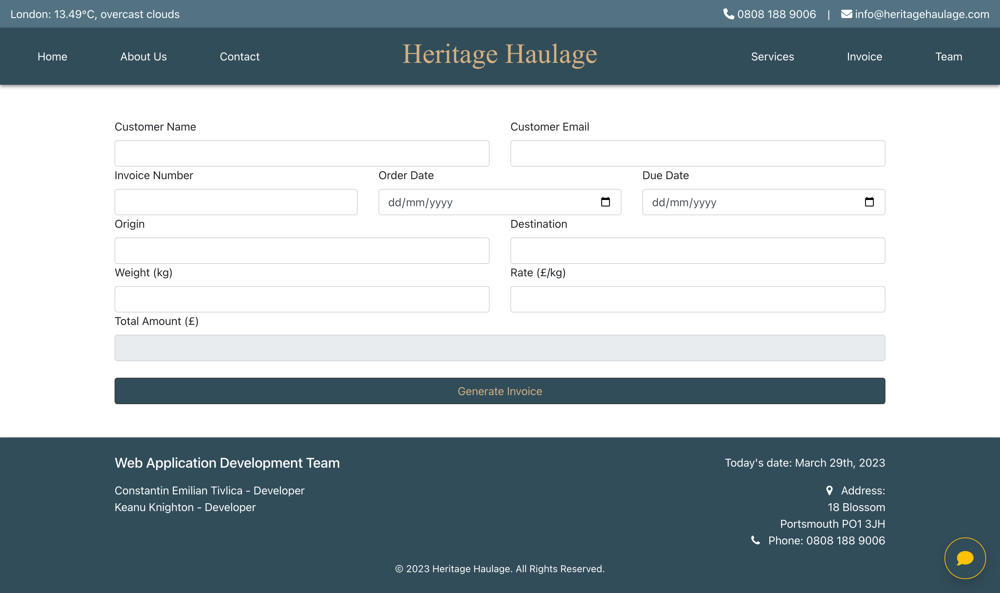
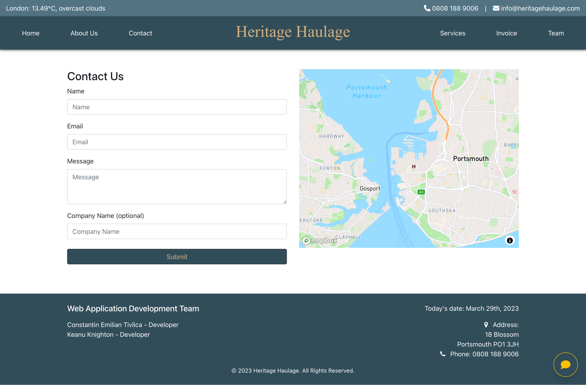
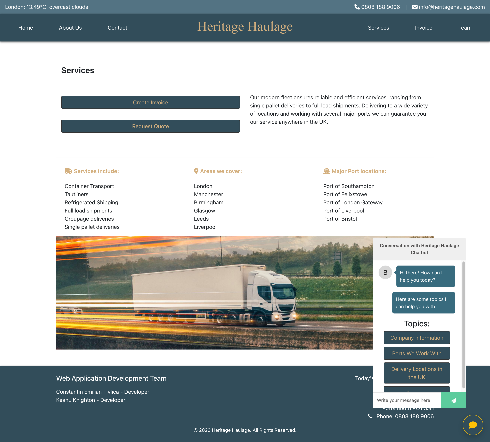

# Heritage Haulage - HGV Container Transport

Heritage Haulage is a web application built for a real HGV containers transport company that picks up and delivers containers to customers from UK ports across the country. This app is designed to provide information about the company, its services, and the team, while offering an interactive map on the contact page and a custom-built invoicing system for the owner to create invoices for the customers.

## Table of Contents

1. [Live Demo](#live-demo)
2. [Features](#features)
3. [Screenshots](#screenshots)
4. [Installation](#installation)
5. [Usage](#usage)
6. [Project Structure](#project-structure)
7. [Tech Stack](#tech-stack)
8. [Credits](#credits)
9. [Contribution Guidelines](#contribution-guidelines)
10. [Future Enhancements](#future-enhancements)

## Live Demo

🚀 Check out the live demo of the Heritage Haulage web app: [Heritage Haulage](https://heritage-haulage.netlify.app)

## Features

- **Responsive design:** The application is optimized for seamless use on various devices, including desktops, tablets, and smartphones.
- **Interactive map integration:** The contact page features an interactive map for users to easily identify the company's location and nearby facilities.
- **Custom-built invoicing system:** The owner can effortlessly create and manage invoices for customers using the intuitive invoicing system.
- **Informative pages:** Dedicated pages provide detailed information about the company's history, services, and team members.
- **Integrated chatbot:** A chatbot is available to answer user queries and provide support when needed.
- **Weather widget integration:** A weather widget displays up-to-date weather information for users' convenience.
- **Contact form:** An easy-to-use contact form allows users to submit inquiries directly from the application.

## Screenshots

## Installation

1. Clone the repository:
git clone <https://github.com/Constantin-E-T/heritage-haulage.git>

2. Install the dependencies:
    cd heritage-haulage
    npm install

3. Run the application:
npm start

## Usage

Open a browser and navigate to `http://localhost:3000`. The web application should now be running and accessible.

## Project Structure

The application is structured as follows:

- `src/`: Main source code directory
- `assets/`: Contains CSS, data, images, and JavaScript files
- `components/`: Contains all React components, including pages, header, footer, chatbot, invoice form, and more
- `App.js`: Main React component that holds the application's routing logic
- `index.js`: Entry point for the application

## Tech Stack

- React: A JavaScript library for building user interfaces.
- JavaScript: The core programming language used for implementing the application's functionality.
- CSS: Used for styling the application and creating a responsive design.
- Node.js: The runtime environment for executing the server-side JavaScript code.
- npm: The package manager for managing dependencies and scripts.

## Credits

- [Constantin Emilian Tivlica](https://github.com/Constantin-E-T) - Developer
- [Keanu Knighton](https://github.com/MoxyK) - Developer

## Contribution Guidelines

We welcome contributions to the Heritage Haulage project. If you'd like to contribute, please follow these steps:

1. Fork the repository.
2. Create a new branch for your feature or bugfix.
3. Make your changes and commit them to your branch.
4. Submit a pull request with a clear description of your changes.
5. Please make sure your code follows best practices and adheres to the existing code style.

## Future Enhancements

- Integration of real-time container tracking for customers to track their shipments.
- Implementation of a customer portal for managing orders and viewing invoice history.
- Expansion of the chatbot's capabilities to provide more detailed information and support.
- Implementing a booking system for customers to schedule pickups and deliveries online.
- Enhanced security features to protect user data and ensure privacy.
- Integration of a notification system to keep customers informed about important updates and changes.
